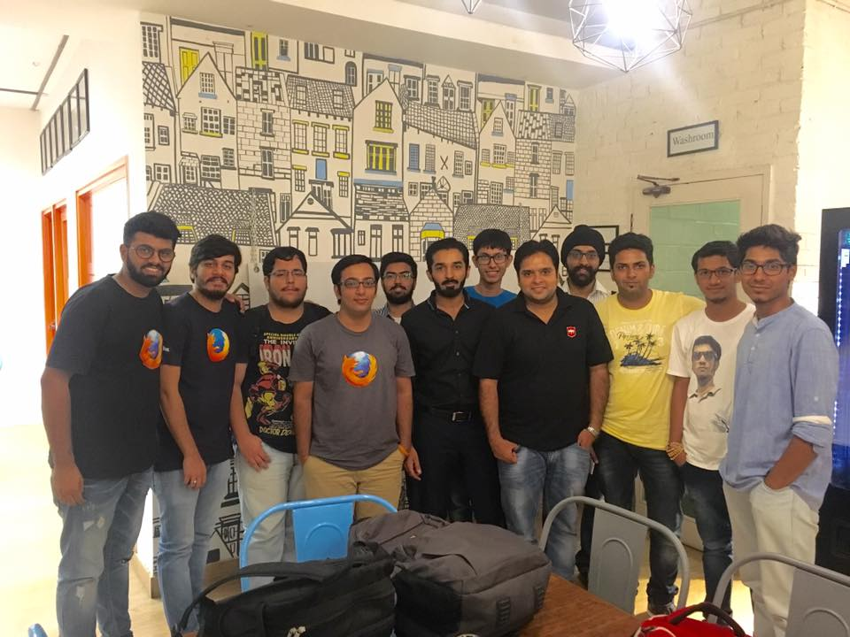

MozCoffee Delhi 7.0
###################
:date: 2016-08-2 18:06
:author: Manraj Singh
:category: blog
:slug: mozcoffee-7-blog

MozPacers organized their 7th MozCofee on Saturday, July 30th, 2016. The attendees were:

1. Anup Mishra
2. Ajay Singhi
3. Prateek
4. Sanyam Khurana
5. Kunal Relan
6. Nikhil Handa
7. Chetanya Kandhari
8. Raounak Sharma
9. Anudit Verma
10. Abhishek Chopra
11. Manraj Singh

Chetanya, Raounak, Anudit and Abhishek were newly inducted Mozillians who were keenly interested in knowing and discussing the ongoings in the Mozilla Delhi Community and how to contribute to Mozilla Code Base.

The MozCoffee started around 12:30 pm on a rain filled day. Anup lead the meeting and we started by introducing ourselves, when we started contributing to Mozilla and our hobbies. Second activity was to form groups with Mozillians they have never met and get to know each other better. Later, each group introduced other person sharing what they're currently doing, projects they've worked on and much more.

Anup then shared the main purpose of the meetup which was to align ourself with the current focus areas of contributions, which are:

1. Firefox Context Graph/TestPilot
2. Future of Platform/Servo
3. Connected Devices
4. Mozilla Issues Agenda and Advocacy
5. Mozilla Leadership Network 

He highlighted each focus area and what it covers. Next, he shared information regarding the Mozilla India Meetup 2016 during August 26-28 at Pune and aim of the meetup which is to align the community with the goals and strategies of Mozilla.

After this, we had a break of 10 minutes which was followed by sharing of ideas on how we can put goals to actions. Manraj shared the idea of having Hands On Session of Connected Devices and involving Mozilla Staff in the process and recording of these sessions for future Mozillians and contributors across the globe. Mozpacers plans to have this session in the next one month. Kunal shared the idea of having devsprint on Rust and fixing bugs in the present code base. He shared resources on "Getting started with Rust" with the community members. 

After this, Anup shared feedback we had received from George Roter, Head of Core Contributors, Mozilla. We discussed the positives and negatives mentioned in the feedback and how we can introduce the changes to convert these negatives to positives. We drafted few goals for our community and plan to finalize them in the coming weeks.

Mozpacers would like to thank all the attendees for attending the MozCoffee, keeping forth their views and contributing to the discussions, thus making the MozCoffee productive.